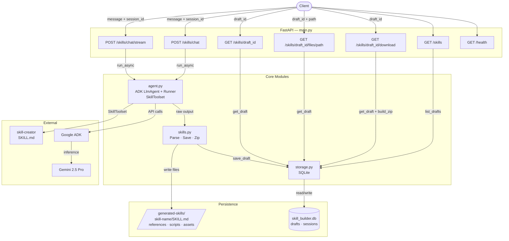
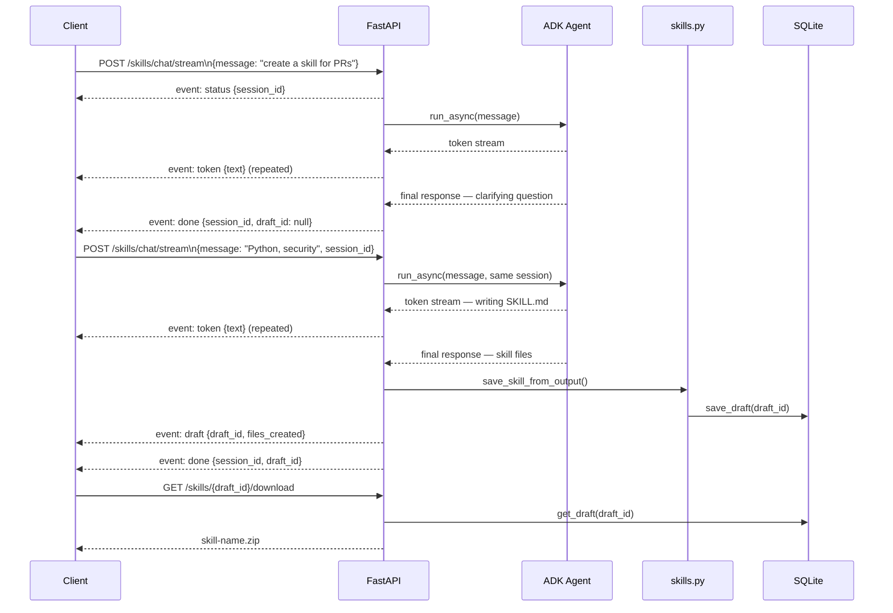

# skill-builder-api

A production-ready FastAPI service that creates [agentskills.io](https://agentskills.io)-compliant skills through multi-turn conversation, powered by [Google ADK](https://google.github.io/adk-docs/) and Gemini 2.5 Pro.

## How it works

1. Start a conversation via `POST /skills/chat/stream`
2. The agent asks clarifying questions, then generates a complete skill
3. Each skill is saved as a draft — fetch or download anytime via `draft_id`
4. Refine the skill across multiple turns using the same `session_id`

### Architecture



### Conversation flow



## Project structure

```
skill-builder-api/
├── main.py        # FastAPI app + all routes
├── agent.py       # ADK agent + runner setup
├── skills.py      # File I/O — save, zip skill directories
├── storage.py     # SQLite persistence for drafts + sessions
├── requirements.txt
└── .env.example
```

## Setup

```bash
git clone https://github.com/seetaram-codebase/skill-builder-api
cd skill-builder-api

pip install -r requirements.txt

# Clone the skill-creator skill
git clone https://github.com/anthropics/skills.git

cp .env.example .env
# Add your GOOGLE_API_KEY

uvicorn main:app --reload
```

## API

### Primary: multi-turn chat with SSE streaming

```bash
curl -N -X POST http://localhost:8000/skills/chat/stream \
  -H "Content-Type: application/json" \
  -d '{"message": "create a skill for reviewing PRs"}'
```

SSE events:
| Event | Payload | When |
|---|---|---|
| `status` | `{message, session_id}` | Turn start |
| `token` | `{text}` | Agent writing (live) |
| `draft` | `{draft_id, skill_name, files_created}` | Skill saved |
| `done` | `{session_id, draft_id}` | Turn complete |
| `error` | `{detail}` | Failure |

Continue a conversation:
```bash
curl -N -X POST http://localhost:8000/skills/chat/stream \
  -d '{"message": "add OWASP checks", "session_id": "abc123"}'
```

### Non-streaming (simple clients)

```bash
curl -X POST http://localhost:8000/skills/chat \
  -d '{"message": "create a skill for reviewing PRs"}'
# → {"session_id": "...", "reply": "...", "draft_id": "..."}
```

### Draft endpoints

```bash
GET  /skills                          # list all drafts
GET  /skills/{draft_id}               # get draft + all file contents
GET  /skills/{draft_id}/files/SKILL.md           # single file
GET  /skills/{draft_id}/files/references/REFERENCE.md
GET  /skills/{draft_id}/download      # download as zip
```

### Health

```bash
GET /health  → {"status": "ok", "version": "1.0.0"}
```

## Environment variables

| Variable | Default | Description |
|---|---|---|
| `GOOGLE_API_KEY` | required | Gemini API key |
| `SKILLS_DIR` | `./skills/skill-creator` | Path to skill-creator SKILL.md |
| `SKILLS_OUTPUT_DIR` | `./generated-skills` | Where generated skills are saved |
| `DB_PATH` | `./skill_builder.db` | SQLite database path |
| `MODEL` | `gemini-2.5-pro` | Gemini model to use |

## Stack

- [FastAPI](https://fastapi.tiangolo.com)
- [Google ADK](https://google.github.io/adk-docs/) with `SkillToolset`
- [agentskills.io specification](https://agentskills.io/specification)
- SQLite (via stdlib `sqlite3`)
- Gemini 2.5 Pro
